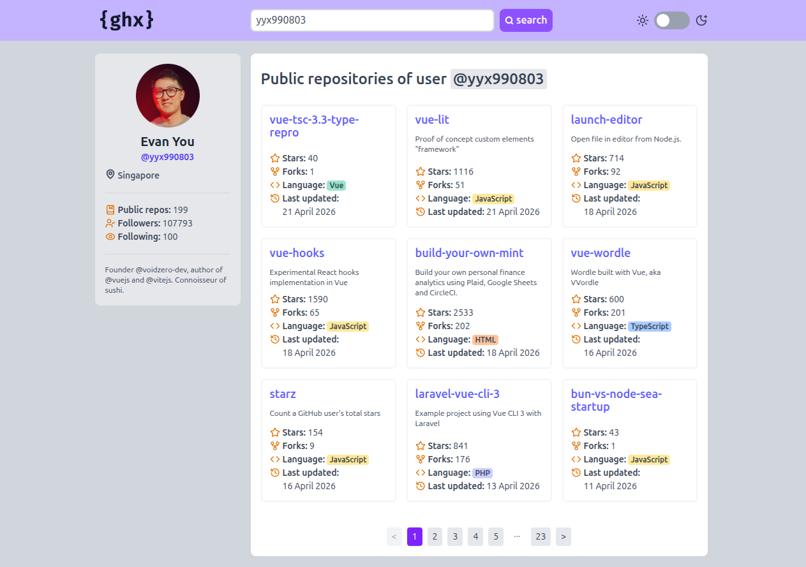

# 🛸 GitHub Explorer — Nuxt Edition

A re-architecture of the [Vue SPA version](https://github.com/cropp8/github-explorer) using Nuxt 4. The goal was to get hands-on with Nuxt's conventions — file-based routing, `useAsyncData`, `useSeoMeta`, server-side rendering and the module ecosystem — while keeping the same feature set.

🚀 **[Live Demo](https://cropp8-ghx-nuxt.netlify.app/)**



## 🛠️ Tech Stack

- **Framework:** Nuxt 4 (SSR)
- **Language:** TypeScript
- **State Management:** Pinia via `@pinia/nuxt`
- **Styling:** Tailwind CSS 4 (`@tailwindcss/vite`)
- **Icons:** `@nuxt/icon` (Lucide)
- **HTTP Client:** `$fetch` / `ofetch` (Nuxt built-in)
- **Color Mode:** `@nuxtjs/color-mode`
- **Linting:** `@nuxt/eslint` with stylistic config

## ✨ Key Features

- **SSR + `useAsyncData`:** Profile pages are server-rendered on first load, with the key scoped to both `username` and `page` to handle cache invalidation correctly.

- **`useSeoMeta`:** Page title updates reactively to the loaded user's name.

- **File-based Routing:** `pages/user/[username].vue` and a catch-all `[...slug].vue` for 404 handling — no router config needed.

- **Global Offline Middleware:** `middleware/offline.global.ts` intercepts navigation when `navigator.onLine` is false and fires a toast instead of letting the route change fail silently.

- **Client Error Plugin:** `plugins/error-handler.client.ts` hooks into `app:error` to catch failed dynamic chunk imports (e.g. after a deploy while the user has the tab open).

- **`useGithubClient` composable:** Wraps `$fetch.create()` with `baseURL`, timeout, and optional `Authorization` header pulled from `runtimeConfig` — replaces the Axios instance from the SPA version.

- **Persistent Search History:** Last 5 unique searches in `localStorage`, shown as quick-access chips on the home page.

- **Custom Toast System:** Same Pinia store + `<Teleport>` approach as the SPA, now integrated with Nuxt's composable auto-imports.

- **Theme Switching:** System preference detection + `localStorage` persistence via `@nuxtjs/color-mode`.

## 🏗️ What Changed vs. the SPA

| Concern | Vue SPA | Nuxt |
|---|---|---|
| Data fetching | Pinia action called in `onMounted` | `useAsyncData` (SSR-aware) |
| HTTP client | Axios instance | `$fetch.create()` via `useGithubClient` |
| Routing | `vue-router` config file | File-based (`pages/`) |
| SEO | Manual `document.title` | `useSeoMeta`, `useHead` |
| Env vars | `VITE_` prefix | `runtimeConfig.public` |
| Error boundaries | Component-level | `app:error` hook |
| Offline handling | Store-level | Global route middleware |

## ♿ Accessibility (A11y)

Same baseline as the SPA, carried over:

- `role="combobox"` / `role="listbox"` + `aria-activedescendant` on the search history dropdown
- `aria-live="polite"` on the toast container, `role="status"` on loading overlays
- `aria-busy` on the results container during fetches
- `focus-visible` rings on all interactive elements; focus moved programmatically to results on route change
- Semantic landmarks throughout (`<main>`, `<header>`, `<nav>`, `<form role="search">`)
- `@nuxt/a11y` module for automated checks during development

## 🚦 Getting Started

```sh
git clone https://github.com/cropp8/github-explorer-nuxt.git
npm install
npm run dev
```

```sh
npm run build     # production build (SSR)
npm run generate  # static site generation
npm run preview   # preview production build
npm run lint      # eslint
npm run lint:fix  # eslint with auto-fix
```

## ⚠️ API Constraints

GitHub's public API allows 60 unauthenticated requests/hour. To raise it to 5,000/hour, add a `.env` file:

```
GH_API_TOKEN=your_personal_access_token
```

A classic token with no scopes is enough. Rate limit errors (`403`) are caught in the store and surfaced via the toast system.

## 🔮 What's Next

- **Vitest:** Unit tests for store logic and composables.
- **Skeleton Loaders:** Replace the global spinner with per-component skeletons.
- **`useCookie` for history:** Move search history from `localStorage` to a Nuxt cookie so it's available server-side.
- **GitHub OAuth:** Proper auth flow to raise the rate limit for all users without requiring a personal token.
